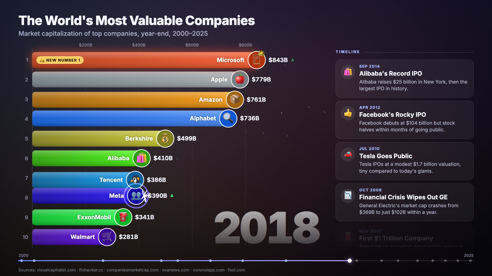
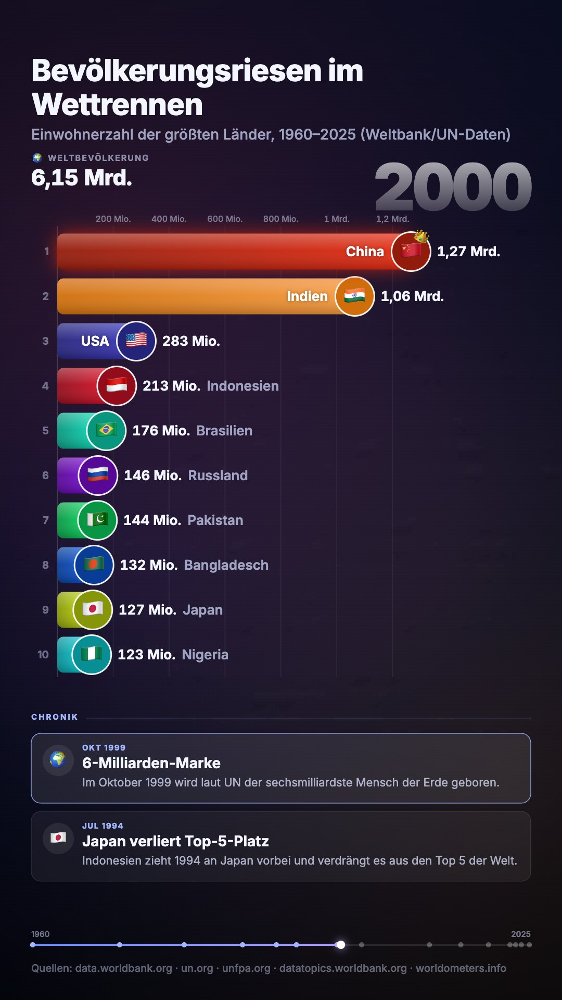

# StatRace

**Turn any topic into an AI-researched bar chart race video.** Type a topic, Claude researches time series,
dated events and sources on the web, and StatRace animates them into a race with fun-fact cards, effects and a
soundtrack, rendered to MP4 right in your browser, in 16:9 for YouTube or 9:16 for Shorts and Reels.

**Try it: [statrace.moinsen.dev](https://statrace.moinsen.dev)**. The examples play without any key; researching
a new topic uses your own Anthropic API key.





## Features

- **Research by Claude:** web search and page fetches produce yearly values for 10–20 entities, 10–16
  dated events with a fun fact each, the sources, and notes on estimates. Open data (Our World in Data,
  World Bank, UN) comes first.
- **A race that looks like the real thing:** bars glide past each other (spring physics plus hysteresis,
  so near-ties don't flicker), sparks on every overtake, a crown and a "new number 1" badge, a big year
  counter, a timeline with event markers, a world-total counter, and final standings with medals.
- **Soundtrack in three ways:**
  - **AI composition:** Claude picks style, tempo, key, chords and a hook, and a Web Audio synthesizer
    plays it in sync with the video's intro, breakdown and finale. Free.
  - **AI music generator:** ElevenLabs Music creates a produced instrumental track of the exact video length.
  - **Your own file.**

  Sound effects for the start, each card and each new leader play on top of any of them.
- **MP4 export in the browser:** H.264 + AAC via WebCodecs and [Mediabunny](https://mediabunny.dev),
  rendered frame by frame. On an M-series Mac, 66 s of 1080p30 takes about 10 s.
- **Editable:** titles, colors, icons, events, sources, or the full JSON. Projects stay in your browser
  (IndexedDB).
- **English and German** interface. Videos can be researched in either language.

## Run it locally

```bash
npm install
npm run dev        # http://localhost:5190
```

Research runs one of two ways:

| Mode | What you need | Notes |
|---|---|---|
| **Claude Code** (local only) | [Claude Code](https://claude.com/claude-code) installed and logged in | Uses the unmodified `claude` CLI with *your own* subscription, for your own use. |
| **Your API key** | An [Anthropic API key](https://console.anthropic.com/settings/keys) | Works everywhere, including the hosted site. About $0.30–0.60 per research run. |

Optional: `cp .env.example .env` and set `ELEVENLABS_API_KEY` so the local server can generate music.
Without a server key, the app asks for your own ElevenLabs key.

## Privacy

The hosted version is a static site with no backend. Your API keys go **straight from your browser** to
`api.anthropic.com` and `api.elevenlabs.io`, never to a StatRace server. They are stored in your browser only
if you tick "remember". Projects and audio live in your browser's IndexedDB.

## About the data

The numbers come from sources Claude found and are often estimates or interpolations; the app shows every
source and note. **Check the figures in the Data tab before you publish a video.** Prefer openly licensed
data (OWID and World Bank are CC BY); Statista figures, for example, may not be republished without a
commercial licence.

## How it works

```
shared/      dataset schema (zod: structured-output contract + validation), research prompt, music request
server/      Hono on Node (native type stripping): /api/status, /api/research (SSE via claude CLI), /api/music
src/engine/  race model (monotone splines, rank springs, overtakes) + canvas renderer: every frame is a pure function of time
src/audio/   composer (offline Web Audio, windowed scheduling), sound effects, mixdown, playback clock
src/export/  MP4 export with Mediabunny
src/lib/     BYOK research in the browser (Anthropic SDK), keys, i18n, IndexedDB store
```

Because every frame is a pure function of time, the preview, scrubbing and the export always show the same
picture.

## Deploy your own

`npm run build` creates a static site in `dist/` that runs on any static host. It uses the visitor's own
keys; the local `server/` is only needed for the Claude Code mode.

```bash
npm run build
npx wrangler pages deploy dist --project-name <your-project> --branch main
```

## Contributing

Issues and pull requests are welcome. See [CONTRIBUTING.md](CONTRIBUTING.md).

## License

[MIT](LICENSE) · made by [moinsen.dev](https://moinsen.dev) in Hamburg

---

**Deutsch:** StatRace macht aus einem Thema ein recherchiertes Bar-Chart-Race-Video mit Ereignis-Karten
und Soundtrack, exportiert als MP4 im Browser. Die Oberfläche gibt es auf Deutsch und Englisch; ausprobieren
unter [statrace.moinsen.dev](https://statrace.moinsen.dev).
